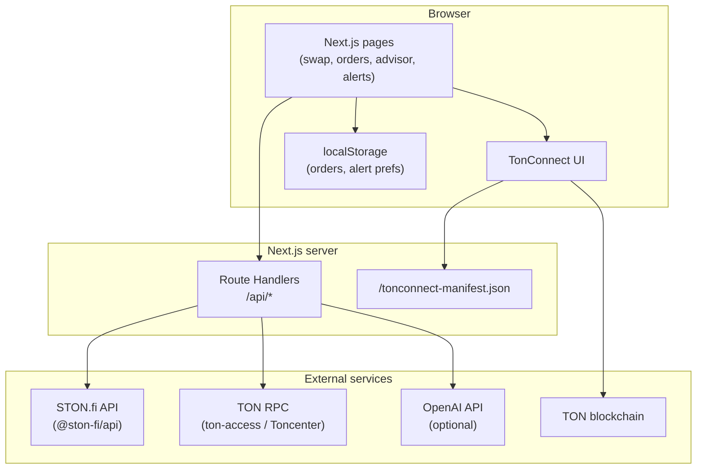
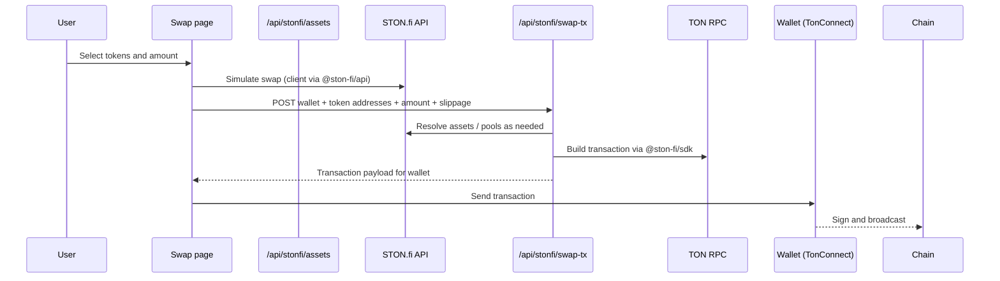

# TON Pilot

**TON Pilot** is a hackathon-style MVP built on [The Open Network (TON)](https://ton.org/). It is a [Next.js](https://nextjs.org/) App Router application that combines **STON.fi** DEX integration (quotes, swap transaction building), **TonConnect** wallet connectivity, and **optional OpenAI** endpoints for natural-language style guidance on swaps and liquidity.

This README describes how the project is structured, how data flows through it, and how to run it locally or deploy it.

---

## Table of contents

- [Features](#features)
- [Tech stack](#tech-stack)
- [Architecture](#architecture)
- [Project layout](#project-layout)
- [Environment variables](#environment-variables)
- [Getting started](#getting-started)
- [TonConnect](#tonconnect)
- [API routes](#api-routes)
- [Limitations and notes](#limitations-and-notes)

---

## Features

| Area | Route | What it does |
|------|--------|----------------|
| **Swap Assistant** | `/swap` | Connect a TON wallet via TonConnect, pick tokens, simulate a swap via STON.fi, optionally get AI “analyze swap” output, and request a server-built swap transaction payload to send from the wallet. |
| **Limit Orders** | `/limit-orders` | UI for placing limit-style orders; order state is stored in **localStorage**. Price monitoring uses simulated or fetched logic in the client (see [Limitations](#limitations-and-notes)). |
| **AI Liquidity Advisor** | `/liquidity-advisor` | Presents a **mock** pool table (APY ranges, risk, short explanations) and calls `/api/liquidity-advice` for a recommended pool (OpenAI when configured, otherwise a deterministic fallback). |
| **Smart Alerts** | `/smart-alerts` | User-configurable thresholds stored in **localStorage**; a lightweight client-side “alert engine” runs on an interval and surfaces toasts plus a small history panel. |

The global header (`AppHeader`) links to all in-app features and to [STON.fi](https://ston.fi).

---

## Tech stack

- **Framework:** Next.js 16 (App Router), React 19, TypeScript
- **Styling:** Tailwind CSS 4
- **TON wallet:** `@tonconnect/ui-react`
- **STON.fi:** `@ston-fi/api` (HTTP API for assets, simulation), `@ston-fi/sdk` + `dexFactory` (swap transaction building on the server)
- **TON connectivity:** `@orbs-network/ton-access` (optional reliable RPC endpoint), `@ton/ton` where needed
- **AI (optional):** `openai` SDK for `/api/analyze-swap` and `/api/liquidity-advice`

---

## Architecture

High-level view: the **browser** talks to **Next.js** (UI + Route Handlers). Server routes call **STON.fi APIs**, **TON RPC**, and optionally **OpenAI**. The wallet signs and broadcasts transactions on TON.



### Swap flow (conceptual)

When a user swaps, the UI typically: loads assets → simulates the swap → optionally asks for AI analysis → asks the server for an encoded swap transaction → sends that transaction via the connected wallet.



---

## Project layout

```
TON_Pilot/
├── public/
│   └── tonconnect-manifest.json    # TonConnect app manifest (update URL for your deployment)
├── src/
│   ├── app/
│   │   ├── api/                    # Route Handlers (server)
│   │   │   ├── health/
│   │   │   ├── analyze-swap/
│   │   │   ├── liquidity-advice/
│   │   │   └── stonfi/
│   │   │       ├── assets/
│   │   │       └── swap-tx/
│   │   ├── swap/, limit-orders/, liquidity-advisor/, smart-alerts/
│   │   ├── layout.tsx
│   │   ├── providers.tsx         # TonConnectUIProvider + manifest URL
│   │   └── page.tsx              # Home
│   ├── components/               # UI building blocks and feature components
│   └── lib/                      # Shared helpers (alerts, liquidity mocks, AI client, etc.)
├── .env.example
├── next.config.ts
├── package.json
└── README.md
```

---

## Environment variables

Copy `.env.example` to `.env.local` and fill in values as needed.

| Variable | Scope | Purpose |
|----------|--------|---------|
| `OPENAI_API_KEY` | Server | Enables AI responses for `/api/analyze-swap` and `/api/liquidity-advice`. If missing or quota-exceeded, routes use **fallback** logic instead of failing the app. |
| `TONCENTER_API_KEY` | Server | Optional; used when resolving TON RPC via Toncenter-style configuration in swap-tx and related code paths. |
| `TON_RPC_ENDPOINT` | Server | Optional explicit TON HTTP API endpoint (overrides default discovery when set). |
| `NEXT_PUBLIC_APP_URL` | Public | Base URL of your deployment (no trailing slash). Used to build the TonConnect manifest URL in production; see [TonConnect](#tonconnect). |
| `NEXT_PUBLIC_APP_NAME` | Public | Display name (optional branding). |
| `STONFI_API_KEY` | Server | Reserved for future STON.fi authenticated API usage if you extend the app. |
| `TONSTAKERS_API_KEY` | Server | Reserved for optional integrations; not required for the core MVP paths. |

**Security:** Never commit real API keys. Rotate any key that was pasted into chat or committed by mistake.

---

## Getting started

**Requirements:** Node.js compatible with Next.js 16 (see Next.js docs), npm.

```bash
cd TON_Pilot
npm install
cp .env.example .env.local
# Edit .env.local — at minimum set NEXT_PUBLIC_APP_URL for production-like TonConnect behavior
npm run dev
```

Open [http://localhost:3000](http://localhost:3000).

Useful commands:

| Command | Description |
|---------|-------------|
| `npm run dev` | Development server |
| `npm run build` | Production build |
| `npm run start` | Run production server |
| `npm run lint` | ESLint |

---

## TonConnect

- The app wraps the tree in `TonConnectUIProvider` (`src/app/providers.tsx`).
- The manifest URL is either:
  - `${NEXT_PUBLIC_APP_URL}/tonconnect-manifest.json`, or
  - On the client, `${window.location.origin}/tonconnect-manifest.json` when the env URL is not set (typical for local dev).
- Update `public/tonconnect-manifest.json` with your real **`url`** and branding before production. The repository may contain a placeholder (for example a Vercel URL).

---

## API routes

| Route | Method | Role |
|-------|--------|------|
| `/api/health` | GET | Simple health check for uptime checks. |
| `/api/stonfi/assets` | GET | Server-side proxy/helper for STON.fi asset metadata (used to avoid CORS or centralize config). |
| `/api/stonfi/swap-tx` | POST | Builds a swap transaction using `@ston-fi/sdk`, TON RPC, and normalized TON vs jetton addresses (`"ton"` vs master addresses). Uses a server-side timeout (e.g. ~90s) to avoid hanging requests. |
| `/api/analyze-swap` | POST | Optional OpenAI analysis of a swap intent; falls back to heuristic JSON if OpenAI is unavailable. |
| `/api/liquidity-advice` | POST | Accepts a list of pools (from the UI mock) and returns a recommended pool; OpenAI optional with fallback. |

---

## Limitations and notes

- **MVP / demo quality:** Pool data on the Liquidity Advisor page is **mocked** (`src/lib/liquidity/mockPools.ts`). APY and risk are illustrative, not live on-chain accounting.
- **Limit orders:** Persistence and monitoring are **client-side**; this is not a production order book or STON.fi limit-order protocol integration unless you extend it.
- **Smart alerts:** Price and volatility signals are **simulated** for demonstration; wire real feeds if you need accuracy.
- **OpenAI:** Requires billing/quota on your OpenAI project; **429** or missing keys trigger **fallback** responses so the UI keeps working.
- **TON addressing:** The swap pipeline normalizes the native TON symbol for the API vs the SDK (e.g. `"ton"` vs jetton master address) to avoid common simulation/build mismatches.
- **Timeouts:** Slow RPC or STON.fi can still cause **504** or long waits; the swap-tx route enforces a maximum wait server-side.

---

## License and disclaimer

This repository is intended as a **hackathon / learning MVP**. It is **not** financial advice. Always verify slippage, fees, and contract risk on mainnet before moving real funds.
